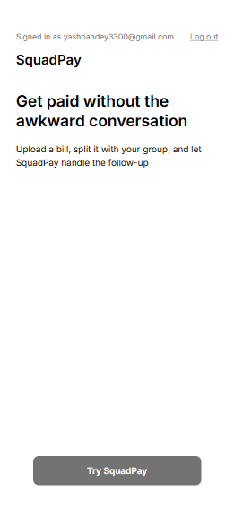
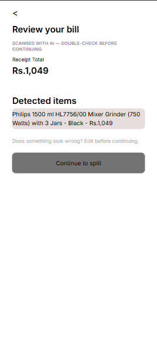
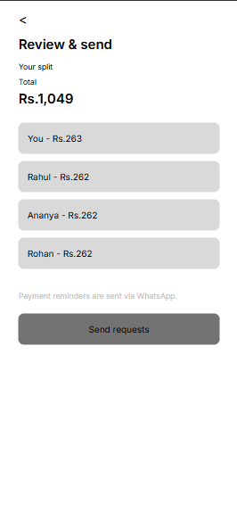

# SquadPay

Splitting the bill is easy. Asking friends to pay you back is awkward. SquadPay handles the second part: scan or type in a receipt, split it, and send everyone a WhatsApp payment request without making them install anything or sign up.

Live demo: https://squadpayy.vercel.app

## Overview

Figuring out who owes what isn't hard, but following up with each person usually is. SquadPay lets the person who paid scan or enter a receipt, choose how to split it (evenly, or item by item so people only pay for what they ordered), add the people involved, and generate a payment request per person with a WhatsApp link attached.

Recipients don't need the app or an account, just the message. Creating and sending a split doesn't require signing in either. An account is only needed if you want a bill saved and tracked over time instead of a one-off.

## Features

- Receipt scanning with Gemini — extracts merchant, items, tax, and tip from a photo
- Manual bill entry, for when there's no receipt or scanning doesn't work
- Equal splitting
- Item-based splitting, with tax/tip split proportionally based on what each person ordered
- Add people by name and phone number
- WhatsApp payment requests/reminders using wa.me links
- Persistent bills for signed-in users, so you can track who's paid
- Scanning, splitting, and sending works without an account

## How it works

Receipt scan or manual entry, then review the bill, add people, split the bill, review and send, then a WhatsApp payment request is ready to send. Each screen reads from and writes to the same in-progress bill, so going back to fix something doesn't lose what you did later.

Gemini only reads the receipt into structured data (merchant, items, amounts). It doesn't do the splitting math. Splitting is plain deterministic arithmetic, covered by tests, and every split sums exactly to the bill total including proportional tax/tip. Whatever Gemini extracts is shown for review before anything is split, not used directly.

## Architecture

- Next.js (App Router) and React
- Supabase for Postgres, magic-link auth, and Row Level Security — tables are owner-scoped at the database level, not just in application code
- Google Gemini for turning a receipt photo into structured JSON, called from a server-only API route
- WhatsApp deep links (wa.me) for payment requests, no WhatsApp Business API involved
- Tailwind CSS v4

## Testing

The split calculation and utility logic (equal/item splitting, tax/tip allocation, phone formatting, relative time formatting) has automated tests using Node's built-in test runner:

```bash
npm test
```

56 tests passing, 0 failing, across lib/splitBill.test.mjs, lib/phone.test.mjs, and lib/formatRelativeTime.test.mjs. These are unit tests on the calculation logic — there's no end-to-end or UI test suite.

## Security

The Gemini API key is only used server-side, in app/api/scan-receipt, and never reaches the browser. The Supabase service-role key is also server-only, used just for the public payment-link lookup by token, with the token match checked in server code rather than an open database policy. User data is protected by Postgres Row Level Security, scoped to the authenticated owner. .env.local and all .env* files are gitignored except .env.local.example, which only has variable names, no values.

## Screenshots

### Home


### Receipt scanning / review


### Split bill


### Review & Send


## Local setup

You'll need Node.js, a Supabase project, and a Gemini API key (free tier at aistudio.google.com).

```bash
npm install

cp .env.local.example .env.local
# fill in the values, see below

# run supabase/schema.sql in your Supabase project's SQL editor
# (Database -> SQL Editor -> New query)

npm run dev
```

Then open http://localhost:3000.

```bash
npm run build   # production build
npm run start   # run a production build locally
npm run lint    # eslint
npm test        # run the test suite
```

## Environment variables

From .env.local.example:

- NEXT_PUBLIC_SUPABASE_URL — Supabase project URL
- NEXT_PUBLIC_SUPABASE_ANON_KEY — Supabase public/anon key, safe to expose in the browser, access is controlled by RLS
- SUPABASE_SERVICE_ROLE_KEY — server-only, used for the public payment-link lookup by token
- GEMINI_API_KEY — server-only, used by the receipt-scanning API route

## Roadmap

- Reliable transactional email for magic-link sign-in in production
- Inline editing of AI-extracted receipt fields on the review screen
- Carrying an anonymous session's bill over if the sender signs in partway through
- Multi-currency support (currently assumes one currency throughout)
- Support for more than one receipt/expense per group
